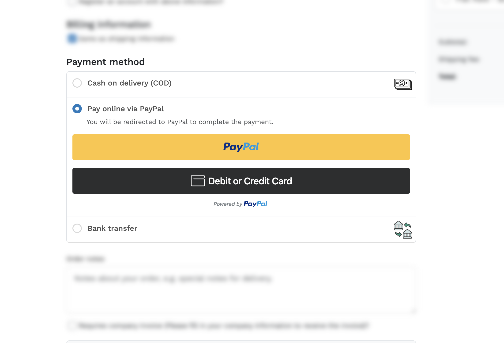
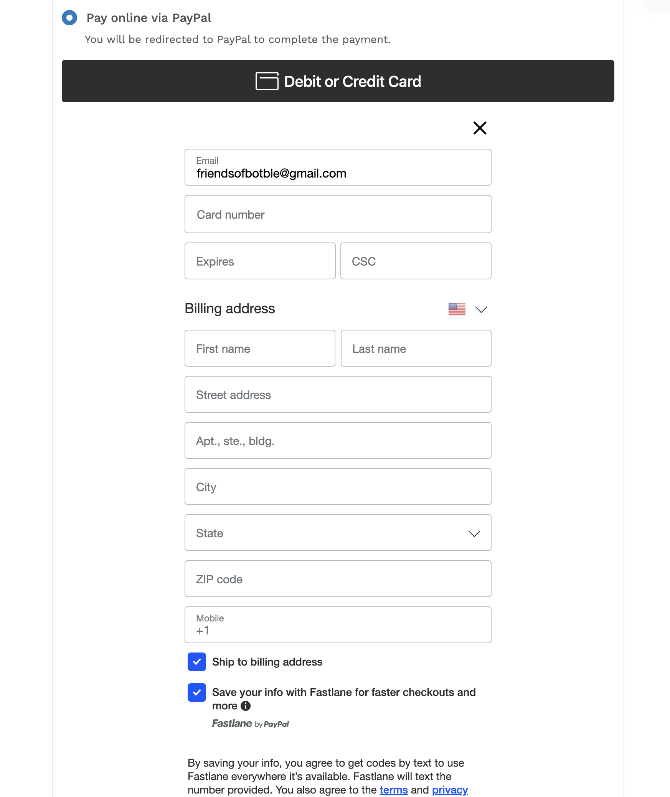
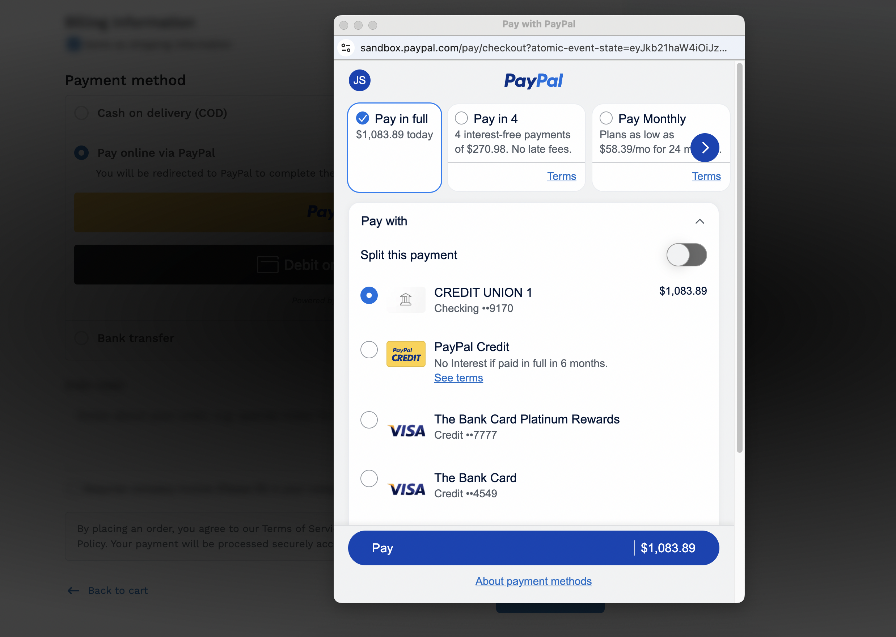

# FOB PayPal Pro

A modern PayPal payment plugin for Botble CMS that integrates PayPal Smart Buttons for seamless inline checkout, webhook support for real-time payment updates, and customizable button styling options.

## Requirements

- Botble core 7.3.0 or higher.
- PHP 8.2 or higher.
- Payment plugin activated.

## Installation

### Install via Admin Panel

Go to the **Admin Panel** and click on the **Plugins** tab. Click on the "Add new" button, find the **FOB PayPal Pro** plugin and click on the "Install" button.

### Install manually

1. Download the plugin from the [Botble Marketplace](https://marketplace.botble.com/products/friendsofbotble/fob-paypal-pro).
2. Extract the downloaded file and upload the extracted folder to the `platform/plugins` directory.
3. Go to **Admin** > **Plugins** and click on the **Activate** button.

## Features

- **Smart Buttons**: Inline PayPal checkout without leaving your site (popup experience)
- **Webhook Support**: Real-time payment status updates for reliable order processing
- **Customizable Buttons**: Configure layout, color, shape, and label to match your brand
- **Multi-currency Support**: All PayPal-supported currencies with auto USD conversion fallback
- **Refund Support**: Full and partial refunds directly from the admin panel
- **Secure Processing**: Server-side order creation with client-side button rendering
- **Payment Details**: View PayPal transaction details in admin order page

## Usage

### For Store Administrators

1. Navigate to **Admin** > **Settings** > **Payment Methods**
2. Find **PayPal** and click to expand settings
3. Enter your PayPal API credentials (Client ID and Client Secret)
4. Configure button appearance options
5. Enable the payment method

### For Customers

1. Add products to cart and proceed to checkout
2. Select "Pay online via PayPal" as payment method
3. Click the PayPal button or "Debit or Credit Card"
4. Complete payment in the PayPal popup
5. Automatically redirected to order confirmation

### Configuration Options

Access settings at **Admin** > **Settings** > **Payment Methods** > **PayPal**:

- **Client ID**: Your PayPal application client ID
- **Client Secret**: Your PayPal application secret key
- **Live Mode**: Toggle between sandbox and production
- **Button Layout**: Vertical or Horizontal arrangement
- **Button Color**: Gold, Blue, Silver, White, or Black
- **Button Shape**: Rectangle or Pill
- **Button Label**: PayPal, Checkout, Buy Now, or Pay
- **Webhook ID**: Optional webhook signature verification

### Webhook Setup (Optional)

1. Go to [PayPal Developer Dashboard](https://developer.paypal.com/dashboard/applications)
2. Select your application and navigate to Webhooks
3. Add webhook URL: `https://yoursite.com/payment/fob-paypal-pro/webhook`
4. Select events: `PAYMENT.CAPTURE.COMPLETED`, `PAYMENT.CAPTURE.DENIED`, `PAYMENT.CAPTURE.REFUNDED`
5. Copy Webhook ID to plugin settings

## Screenshots

## Comparison with botble/paypal

| Feature | botble/paypal | FOB PayPal Pro |
|---------|---------------|----------------|
| **Checkout Flow** | Redirect to PayPal | Inline Smart Buttons |
| **User Experience** | Leaves site → PayPal → Returns | Stays on site (popup) |
| **Webhook Support** | No | Yes |
| **Button Customization** | No | Layout, color, shape, label |
| **SDK** | PHP (paypal-checkout-sdk) | JavaScript (PayPal JS SDK) |
| **Payment Capture** | On return callback | Immediate via AJAX |

### When to Use Each

**Use botble/paypal when:**
- Simpler integration preferred
- No need for inline checkout
- Existing site works with redirects

**Use FOB PayPal Pro when:**
- Better UX is priority (no redirects)
- Need button styling options
- Want webhook reliability
- Modern checkout experience

The main advantage of FOB PayPal Pro is the inline checkout - customers never leave your site, reducing cart abandonment.

## Contributing

Please see [CONTRIBUTING](CONTRIBUTING.md) for details.

## Bug Reports

If you discover a bug in this plugin, please [create an issue](https://github.com/FriendsOfBotble/fob-paypal-pro/issues).

## Security

If you discover any security related issues, please email friendsofbotble@gmail.com instead of using the issue tracker.

## Credits

- [Friends Of Botble](https://github.com/FriendsOfBotble)
- [All Contributors](../../contributors)

## License

The MIT License (MIT). Please see [License File](LICENSE) for more information.
